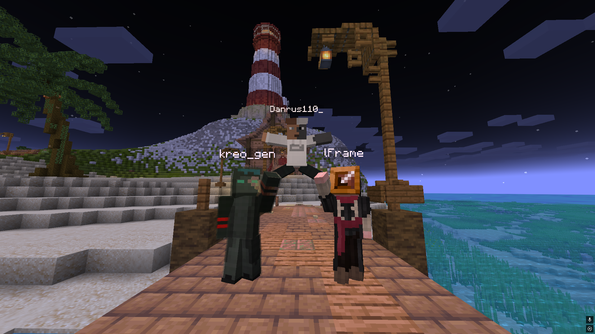

# Player Armor Stands

## Features:
1. Rename Armor Stand to add the desired player's skin to it

2. Auto download from Mojang servers

3. To display slim arms, you need to set name like "Player|S"
4. To display a cape, you need to set name like "Player|C"
5. You can combine these two features, for example, "Player|SC" will display a player with a cape and slim arms

## Try it with [Armor Poser](https://modrinth.com/mod/armor-poser):
